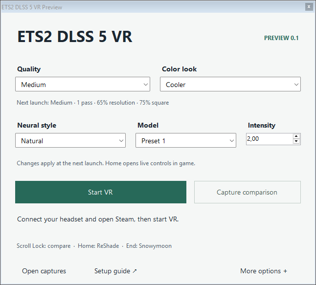

# ETS2 DLSS 5 VR Preview v0.1

### [View interactive comparisons →](https://einareb.github.io/ETS2-DLSS-5-VR-Preview/)

Choose the cab or truck exterior, then drag the before/after slider. Medium has real in-game comparisons now; Low, High and Ultra comparisons are awaiting processing. [Setup guide](#install-in-three-steps) · [Current test status](docs/VALIDATION.md)

Neural rendering for **Euro Truck Simulator 2 in VR**, with Snowymoon lighting, separate processing for each eye, and simple quality controls.

**Release candidate — final headset validation pending.** The earlier private build has a visible effect in both eyes. This candidate adds the installer, launcher, comparison key and a revised driver connection. Those changes still need a final in-game test. It is an experimental community integration, with visible artifacts and a narrow tested configuration.

**Source preview is available now; the packaged download is pending the final headset test.** The installation guide below describes the prepared release. The comparison page and its full-resolution images are hosted with this repository on GitHub Pages.

## Before downloading

- Windows 11 x64, Steam ETS2 **VR build 1.60.1.1007**, DirectX 11 / OpenXR.
- The tested system uses **RTX 5070 Ti 16 GB, driver 616.64, Quest 3 and Virtual Desktop / VDXR**. Other GPUs, drivers and runtimes have not been validated for this preview. It does not include patches for older RTX generations.
- Your own **Snowymoon Lighting v2.5.7** access or subscription.
- The exact neural add-on and model files listed below. **The supplied model-archive link expires on 7 September 2026, 12:37 UTC.** After that, obtain a refreshed link from the original Discord post. Check that you can obtain them before preparing an installation; a newer file with the same name is not interchangeable.
- At least **8 GB free** on the NTFS drive containing ETS2. Comparison captures can use several additional GB.
- [Microsoft Visual C++ x64 runtime](https://learn.microsoft.com/en-us/cpp/windows/latest-supported-vc-redist). Setup checks for it and explains if it is missing.

The aim is 5–10 minutes of hands-on setup after the downloads are ready. Downloading the game branch, obtaining third-party files and activating Snowymoon take additional time. Fresh-user setup timing has not yet been measured.

The tested Steam branch is **oculus**: Library → Euro Truck Simulator 2 → Properties → Betas. Its available build can change; the installer checks the executable itself. Do not replace an unsupported game executable with a file from another source.

## Install in three steps

### 1. Add your files

Extract the preview release ZIP into a normal writable folder. Open **Read me first.html**, then put these five files in its **Required files** folder:

| File to add | Exact version and where to obtain it |
| --- | --- |
| `ReShade_Setup_6.8.0_Addon.exe` | [ReShade 6.8 with full add-on support](https://reshade.me/downloads/ReShade_Setup_6.8.0_Addon.exe). Leave the EXE in the folder; our setup reads its runtime without running the ReShade installer. |
| `ets2ats_lighting_v2_5_7_snowymoon.io.zip` | [Snowymoon 2.5.7 ZIP](https://cdn.snowymoondl.net/lighting_v2/ets2ats_lighting_v2_5_7_snowymoon.io.zip), from the [author's site](https://snowymoon.io/). Leave this ZIP intact. |
| `renodx-dlss5.addon64` | **Classic Krish build, version 0.2026.827.2036, 391,168 bytes.** The matching standalone file is listed on [yumlevi's community release page](https://github.com/yumlevi/renodx-dlss-installer/releases/tag/latest); see the [provenance note](docs/REQUIRED-FILES.md). Choose `renodx-dlss5.addon64`, not the separate `-v2.5` asset. |
| `nvngx_dlss.dll` | **310.8.0.0, 58,956,400 bytes**, from the [310.8 / Streamline 2.13 archive](https://cdn.discordapp.com/attachments/1545049227321810974/1545050050609025114/DLSS310.8.0-Streamline2.13.zip?ex=6a9eaffd&is=6a9d5e7d&hm=9497e1aa86dccdbc5116dbffad5000dc699a89f9c71636797082f8678617d31d&). Extract this file. Link expires 7 September 2026, 12:37 UTC; see the [download notes](docs/REQUIRED-FILES.md). |
| `nvngx_dlssnr.dll` | **310.8.0.0, 165,840,496 bytes**, from the same archive. Use the tested original file for RTX 50-series, not a patched older-GPU replacement. |

The release contains none of these files. Obtain them from their authors or another source authorized to provide them. See [required-file fingerprints](docs/REQUIRED-FILES.md) if setup reports a different version. The ShortFuse `renodx-dlss.addon64` and newer Krish V4.7 builds are separate implementations and are not accepted by this candidate.

### 2. Prepare the preview

Run **Setup ETS2 VR Preview.exe** and select **Check files**. Setup finds ETS2 through Steam; use Browse if you have more than one installation.

Choose a **new folder on the same drive as ETS2** — for example `E:\ETS2-VR-Preview` — and select **Prepare preview**. Leave the desktop shortcut option selected. Setup validates the inputs before creating anything, then prepares a separate renderer and settings folder. It does not start the game.

Your usual Steam installation, campaigns and mod order stay in place. The preview shares the large game archives without duplicating them and copies the executable and renderer components. Do not move the prepared folder later; its paths are fixed during setup.

### 3. Connect and drive

1. Keep Steam running. Connect the headset through Virtual Desktop and select VDXR as your OpenXR runtime.
2. Open the **ETS2 DLSS 5 VR Preview** desktop shortcut. Start with **Medium · Natural · intensity 2 · Cooler color**.
3. Select **Start VR**. On first launch, create a **new local profile with “Use Steam Cloud” unchecked**. Complete the input wizard for your controller or wheel. The installer copies global graphics settings; profile-specific wheel bindings and campaigns are not imported.
4. Activate Snowymoon through its own menu if prompted. **End** opens that menu. This preview does not supply or copy subscriber credentials.
5. Enter the truck. Allow shaders and neural rendering to initialize, then close all menus. The launcher reports recent successful neural evaluations for both eyes once it sees them.
6. With the game focused, press **Scroll Lock** to compare the original image with the neural edit. Press again to restore the edit.

## Controls

| Control | What it changes | Restart? |
| --- | --- | --- |
| **Low / Medium / High / Ultra** | Neural input size, centered square and pass count | **Yes. Close ETS2 completely and relaunch.** The menu distinguishes active and saved values. |
| **Square size** in Home → Add-ons → DLSS 5 Feed | The centered portion processed in each eye; the surroundings retain the original image | **Yes** |
| **Natural / Default / Cinematic**, intensity | The neural consumer's style and strength | Launcher changes apply on next launch; the add-on exposes live controls in game |
| **Model preset** | Classic consumer's Default / Preset 1 / Preset 2 / Preset 3 request | Launcher changes apply on next launch; Preset 1 is the tested starting value |
| **VR color look** in the Feed add-on | Optional grading after neural rendering | No; allow the next VR frame / shader reload |
| **Scroll Lock** or **Pause** | Final neural blend 0% ↔ 100% | No |
| **Final effect blend** | Manual blend between the original image and neural edit | No |
| **Home / End** | ReShade / Snowymoon menus | No |

The comparison key hides the neural edit while keeping its processing and history active. It is an image comparison, not an FPS benchmark. Other enabled color effects remain visible at 0%. Moving the blend slider saves a new starting value and ends the temporary keyboard comparison.

Model-preset names match this Classic add-on. Changing a preset request does not guarantee different model weights or a stronger effect in the supplied 310.8 file. Model preset, neural style and Low/Medium/High/Ultra quality are separate controls.

On the monitor, ReShade's **Home tab selects desktop shaders**. Use **Add-ons → DLSS 5 Feed → VR color look** to change the headset look from that menu. This prevents accidentally applying the desktop preset to VR.

| Quality | Passes per eye | Work resolution | Centered square |
| --- | ---: | ---: | ---: |
| Low | 1 | 50% | 60% of the shorter eye side |
| **Medium** | **1** | **65%** | **75% of the shorter eye side** |
| High | 2 | 80% | 90% of the shorter eye side |
| Ultra | 2 | 100% | Disabled: whole eye |

Work resolution scales the selected region. A 100% square still crops a rectangular eye; disable the square to process the whole image. The edge blends softly into the surroundings. It is fixed at the center of each eye, not eye tracking or dynamic foveation.

Medium is the starting point because steady frame delivery reduced visible artifacts in private testing. The earlier build sustained approximately **36 application FPS** in the retained Medium sessions on the tested machine, with Virtual Desktop at 72 Hz using spacewarp. That is an observation from a few scenes, not a performance guarantee. High and Ultra cost substantially more.

## What to expect

This changes the appearance of lighting and surfaces. It is not an engine-integrated global illumination solution, frame generation or a DLSS upscaler for ETS2. Motion is estimated from images and paired depth; the game does not supply complete native motion vectors to this integration. Thin details, occlusion changes, moving scenery and differences between eyes can still flicker or deform.

Start with the supplied mod-free preview. Its lighting and grading have been tuned together; additional graphics packs, overlays, frame generation and post-processing have not been validated. Snowymoon's normal instructions do not support ReShade 6.5 and newer; this preview uses its own isolated ReShade 6.8 loading arrangement. It is not an author-supported Snowymoon installation method.

The **monitor aspect correction remains experimental**. It only runs on an eligible desktop presentation thread and never edits headset textures. A correct ReShade screenshot does not prove that the final monitor projection has the correct proportions.

## Help, captures and returning to your game

- **Waiting for NGX / no visible effect:** enter a driving scene and check Home → Add-ons. Confirm all required files passed setup. If the Feed add-on says a restart is required, close ETS2 completely and relaunch. Do not install a second neural consumer.
- **FPS too low:** select Medium or Low and restart. Lower Virtual Desktop resolution or ordinary game settings if needed. Keep the game at 100% internal scaling initially. Do not add extra passes until frame delivery is stable.
- **Controls feel wrong:** configure the new local profile through the game input wizard; your usual profile is separate.
- **Steam updated the game:** the launcher stops if the original executable or shared archives changed. Use a preview release that supports the new build and prepare a new folder.
- **Capture a comparison:** use the launcher button or Home → Add-ons → DLSS 5 Feed → Record screenshots or motion. It records four stereo frames before optional grading and can briefly pause rendering. **Save final VR image** includes the color look.
- **Report a problem:** select **Save diagnostics** and review `preview-diagnostics.json` before attaching it to an issue. Include your GPU, driver, headset, runtime, quality preset and what happened. It contains status and component hashes, not saves, account files or images. Captures and full logs are optional and may reveal personal paths or scene information.
- **Return to normal:** close ETS2, leave the launcher open for its settings check, then use Steam normally. To remove the preview, keep any saves or captures you want, then delete only its separate folder and desktop shortcut. Deleting the archive links there does not delete the Steam originals. Never edit those shared `.scs` archives in place.

## Source and credits

See [how the pipeline works](docs/PIPELINE.md), [build instructions](docs/BUILD.md), [validation status](docs/VALIDATION.md) and [component notices](THIRD-PARTY-NOTICES.md).

The integration builds on **DLSS5-Feeder, NIGos' bridge, ReShade, Vort's optical-flow estimator and prod80's color effects**. New preview code is MIT; component licenses remain separate. The included optical-flow estimator is **CC BY-NC 4.0**, so the complete package is not wholly MIT. Proprietary game, paid-mod, consumer and model files are user-supplied. This is an independent community project, with no affiliation or endorsement by SCS Software, Snowymoon, ReShade, RenoDX or NVIDIA.
